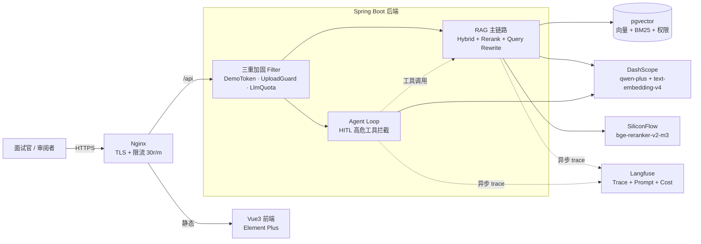

# RAG Learning

> 企业知识库 RAG + Agent 问答系统 · Spring Boot 3.3 + Vue 3 + pgvector + Langfuse · **已通过 Docker Compose 部署到云端 ECS，支持在线演示**。

## 在线演示

| 项 | 值 | 备注 |
|---|---|---|
| 主应用 | <https://rag.chandlerblog.com> | Vue3 前端，聊天/知识库/Agent/RAGAS 四页 |
| 演示 token | 当前空放行 | 无需 header，靠日 LLM 配额 + Nginx 限流 + 关上传接口三层兜底 |
| Langfuse 观测 | <https://observability.rag.chandlerblog.com> | Viewer 只读账号 `viewer@rag-demo.local` / `RagDemo2026!Read` |
| Langfuse 公开 trace | [hybrid + rerank 示例](https://observability.rag.chandlerblog.com/project/cms8krwi10005984gmcqunm6j/traces/9df5c93577ba6f140203fd95e7795ea2?timestamp=2026-07-31T09%3A02%3A17.764Z) | 无需登录可直接看 chat message + token usage + latency |
| 录屏 | *TBD（Step 6 后半段补录）* | 5-8 分钟走完 4 个业务页 + Agent HITL + Langfuse 观测 |

**演示环境边界（安全兜底）**：上传接口关闭（只读知识库，5 篇脱敏 markdown）；每日 LLM chat 上限 500 次；Nginx 单 IP 30 req/min；额度耗尽或触限均返回 429 而非 500，若 UI 出现"演示额度已用完"请直接看录屏。

## 架构总览



- **前端**：Vue 3 + Vite + Element Plus，nginx 一体化容器同时承担静态服务、`/api` 反代、TLS、限流
- **后端**：Spring Boot 3.3，三重加固 Filter 挡在业务链路前，RAG 主链路（Hybrid + Rerank + 可选 Query Rewrite）与 Agent Loop（LLM tool-call + HITL 高危拦截）共享检索层
- **数据**：pgvector 一表承担向量检索、BM25 关键词、行级权限；schema 维度硬约束，切模型必须同步改
- **观测**：Langfuse 独立 stack，Spring Boot 通过内网直通上报（不绕公网 TLS），业务栈挂了不影响 RAG 主链路
- **外部 LLM**：DashScope（qwen-plus 生成 + text-embedding-v4 检索）+ SiliconFlow（bge-reranker-v2-m3 精排）

## 项目简介

Java 17 + Spring Boot 3.3.7 后端 + Vue 3 前端的**企业知识库 RAG + Agent 问答系统**。文档上传（演示环境已关闭）经文本解析、chunk 切分、embedding 与向量检索为用户问题召回相关资料，基于上下文调用大模型生成答案，sources 引用来源由后端根据实际进入 context 的 chunk 生成而非模型编造。除 RAG 主链路外，还实现了 Agent 多轮工具调用（含 HITL 高危工具拦截）、混合检索 + Rerank、RAGAS 评估体系、Prompt Caching 成本优化、Langfuse LLM 可观测性等工程能力。**已通过 Docker Compose 部署到云端 ECS，支持 HTTPS + Nginx 限流 + 演示 token + LLM 调用配额四重加固**。

## 核心能力

- 文档上传：支持上传 txt、markdown 文档，保存文档基础 metadata。
- chunk 切分：按配置的 chunk size 和 overlap 将文档切成可检索片段。
- embedding：上传文档后为每个 chunk 调用 embedding API 并暂存在内存中。
- 向量检索：用户问题先生成问题向量，再用 cosine similarity 检索相关 chunk。
- 混合检索（Hybrid）：向量检索与 BM25 关键词检索并行召回，再用 RRF（倒数排名融合）合并，补足纯向量在编号、专名、缩写上的短板。
- Rerank 精排：混合召回后可选接入 bge-reranker 交叉编码器对候选重排，取 top_k 喂给 LLM；rerank 失败自动降级回 RRF 融合顺序，不中断链路。
- Query 改写：可选用 LLM 把口语化问题改写成检索友好 query（仅用于检索，作答仍用原问题），失败自动降级回原 query。
- 基于上下文回答：将召回 chunk 构造成编号 context，再调用 LLM 生成答案。
- sources 引用来源：后端根据实际进入 context 的 chunk 生成 sources，不依赖模型编造。
- 无答案兜底：无检索结果或无可用上下文时返回“根据现有资料无法回答。”
- 文档更新和删除：更新时废弃旧 chunk 和旧 embedding，删除时标记 DELETED 并移除向量。
- 基础权限过滤：检索前按 visibility、ownerId、department 做第一版 metadata filter。
- debug / eval / 成本统计：支持召回调试、固定评估集、embedding/search/chat 耗时和长度统计。
- RAGAS 评估体系：Java 侧导出评估 JSON，Python 旁路用官方 ragas 出分（faithfulness / answer relevancy / context precision / recall），量化对比不同检索方案。
- LLM 可观测性：可选接入 Langfuse，在 LLM 唯一出入口按 requestId 串成 trace，记录完整 prompt/输出与 token 成本。
- Prompt Caching：可选对生成侧 system 前缀注入 `cache_control`，命中后计费输入 token 下降约 58%（仅 `chat` 风格生效）。
- 多端点适配：LLM 客户端支持 `responses`（OpenAI Responses API）与 `chat`（/v1/chat/completions）两种调用风格切换。

## RAG 离线入库流程

```text
上传 txt / markdown 文档
        |
        v
校验文件类型和读取文本
        |
        v
保存 DocumentInfo metadata
        |
        v
按 chunk-size + overlap 切分文本
        |
        v
为每个 DocumentChunk 计算 contentHash
        |
        v
调用 Embedding API 生成向量
        |
        v
内存保存 chunk -> embedding
```

## RAG 在线问答流程

```text
用户提问
   |
   v
对问题生成 embedding
   |
   v
按文档状态 / 版本 / 权限过滤可检索 chunk
   |
   v
计算 cosine similarity 并取 top_k
   |
   v
按 threshold 过滤低分结果
   |
   v
构造编号 context: [1] [2] [3]
   |
   v
调用 LLM 生成答案
   |
   v
返回 answer + 后端生成的 sources
```

## 关键设计说明

- 为什么要 chunk：企业文档通常较长，不能整篇塞进 prompt。chunk 可以让检索粒度更细，减少无关上下文，并控制输入长度和成本。
- 为什么 sources 由后端生成：模型可能编造引用编号，正式 sources 必须来自后端实际进入 context 的 chunk，才能保证可追溯、可展示、可排查。
- 为什么不能只依赖 prompt：prompt 只能约束模型回答方式，不能保证资料权限、版本正确性和引用真实性；权限过滤、版本过滤、sources 生成必须由后端控制。
- 文档更新为什么不能只追加 chunk：旧 chunk 如果仍可检索，可能和新制度一起进入上下文，导致过期或冲突答案。更新时必须废弃旧版本 chunk 和 embedding。
- 如何控制成本和上下文长度：通过 `top_k`、`chunk size`、`context max chars`、`max output tokens` 控制召回数量、上下文长度和输出长度，避免无脑塞入大量 chunk。

## 检索质量升级：混合检索 + Rerank

纯向量检索擅长理解语义，但在精确关键词、编号、专名、缩写上容易翻车——例如订单号 `A12345` 可能召回语义相近但编号错误的 `A12346`。为此引入两段式检索：

- 召回阶段：向量检索（稠密，懂语义）与 BM25 关键词检索（稀疏，懂字面）各召回 `recall-top-k` 条候选，用 **RRF（倒数排名融合）** 合并——只看排名不看分数量纲，文档排第 r 名得 `1/(k+r)` 分，两路相加重排。
- 精排阶段：可选接入 **bge-reranker 交叉编码器**，把 query 与候选拼在一起逐词交互打分，对融合后的候选重排再取 top_k。Bi-Encoder（双塔）适合快速召回，Cross-Encoder 精度高但慢，所以只用它精排少量候选，而不是全库召回。

通过 `rag.search.mode` 在 `vector` / `hybrid` / `hybrid_rerank` 之间切换，默认保持纯向量行为。rerank 调用失败时自动降级回 RRF 融合顺序，不报错、不中断链路（`debugInfo` 标记为 `rrf`）。

## Query 改写

用户问题常常口语化、有省略或指代。`rag.query-rewrite.enabled` 打开后，会先让 LLM 把问题改写成检索友好的 query，再用改写后的 query 去检索；**作答 prompt 仍使用原始问题**，改写只优化检索不改变回答语境。LLM 调用失败或返回空时自动降级回原 query。注意：在已经规范化的 FAQ 语料上改写未必有增益，价值主要体现在口语化、省略多的真实用户问题上——是否开启应以评估数据为准。

## RAGAS 评估体系

没有评估的 RAG 优化等于玄学。本项目用 Java 侧导出评估数据、Python 旁路（`eval/`，钉 ragas 版本的独立 venv）跑官方 ragas 出分的方式，量化对比 `vector` / `hybrid` / `hybrid_rerank` 三种检索方案：

- 检索指标：Hit@K、relevance@K、检索延迟 p50。
- 生成指标（LLM-as-Judge）：faithfulness（忠实度）、answer relevancy（切题度）、context precision（相关上下文排序）。

关键认知：当数据集召回已饱和（Hit@K 都接近 100%）时，混合检索/重排的增量体现在 context precision 与排序质量，而非召回率；rerank 会带来明显的检索延迟代价，需按场景权衡是否启用。这正是做评估的价值——用数据判断技术是否真正有用，而不是盲目堆叠。

## LLM 可观测性（Langfuse）

结构化日志能告诉你错误发生在链路哪一步，但复现不了模型当时看到的完整上下文，也算不清成本分布。`langfuse.enabled` 打开后，在 LLM 唯一出入口（`LlmClient.generateWithUsage`）按 `requestId` 埋点串成 trace，补齐两点：完整 prompt + 模型原始输出可视化、按 trace/请求类型的 token 成本 dashboard。埋点是 fire-and-forget 异步上报，失败仅 `log.warn` 吞掉，不影响主链路。本地可用 `docker-compose.langfuse.yml` 起一套 Langfuse。

### 生产环境部署

演示环境把 Langfuse 起在同一台 ECS 上，通过 `observability.rag.chandlerblog.com` 子域名对外，Spring Boot 通过 docker 内网直通 `http://langfuse-server:3000` 上报（不绕公网 TLS）。观测栈独立于主 stack，挂了不影响 RAG 服务。

**前置**：

1. DNS 加 `observability` 子域名 A 记录指向服务器公网 IP
2. `.env.prod` 填齐 5 个 Langfuse 变量（`LANGFUSE_POSTGRES_PASSWORD` / `LANGFUSE_NEXTAUTH_URL` / `LANGFUSE_NEXTAUTH_SECRET` / `LANGFUSE_SALT`），前 3 个用 `openssl rand -base64 24/32` 随机生成
3. certbot standalone 为子域名单独发一次证书（步骤见 `frontend/nginx.conf` Langfuse server 块注释）

**启动**：

```bash
# 1. 起 Langfuse stack（复用主 stack 的 rag-net 内网）
docker compose -f docker-compose.langfuse.yml --env-file .env.prod up -d

# 2. 访问 https://observability.rag.chandlerblog.com 注册 root
#    注册完毕后 .env.prod 里 LANGFUSE_AUTH_DISABLE_SIGNUP=true，禁掉公开注册防被薅：
docker compose -f docker-compose.langfuse.yml --env-file .env.prod up -d --force-recreate langfuse-server

# 3. Langfuse UI → New Project → Settings → API Keys → Create new API keys
#    把 pk/sk 填到 .env.prod：
#      LANGFUSE_ENABLED=true
#      LANGFUSE_PUBLIC_KEY=pk-lf-xxx
#      LANGFUSE_SECRET_KEY=sk-lf-xxx

# 4. 让 Spring Boot 读到新 env，重建 app 容器（restart 不重读 env）
docker compose -f docker-compose.prod.yml --env-file .env.prod up -d --force-recreate app
```

### 面试演示凭证

面试官/审阅者可通过以下**只读账号**登录查看 trace 列表、prompt/answer 完整内容、token 成本、latency 分布等观测数据：

| 项 | 值 |
|---|---|
| 访问地址 | https://observability.rag.chandlerblog.com |
| Email | `viewer@rag-demo.local` |
| Password | `RagDemo2026!Read` |
| 权限 | Viewer（只读，不能修改/删除任何数据） |

**建议查看动线**：Traces 页 → 挑一条 hybrid+rerank 的问答 → 点进去看顶部 chat 概览（system/user/assistant 三段气泡）→ 展开 `llm_call` generation → 观察 Usage 里的 input/output/cached token 数、latency。

**Langfuse 挂了会怎样**：`LangfuseClient` 异步 fire-and-forget、`log.warn` 静默吞异常，主链路不受影响；`LANGFUSE_ENABLED=false` 时全程 no-op。观测栈单独下线不影响 RAG 服务，符合"业务栈 vs 观测栈解耦"的部署原则。

## Prompt Caching：生成侧成本优化

Langfuse 省的是「看清成本」，Prompt Caching 省的是「降低成本」——前者观测，后者优化。生成侧大模型按输入 token 计费，而 system prompt、工具定义、few-shot 这些**每次都一样的前缀**反复重算、反复收费。Prompt Caching 让模型服务端按前缀匹配缓存这段 KV 计算结果，命中后这部分输入不再重复计费。

`llm.cache-enabled` 打开后（仅 `chat` 风格生效），在 system 消息上注入 `cache_control: {type: ephemeral}`（DashScope/Qwen 显式缓存契约）。两条硬约束：① 稳定前缀须 ≥1024 token 才会触发缓存；② 隐式（auto）缓存命中率飘忽、不可依赖，显式 marker 才是可靠契约。实测在 Agent 多轮链路上命中率 73%、**计费输入 token 下降约 58%**——注意这一规模下可靠收益是成本而非延迟。可复现的量化 harness 见 `AgentPromptCachingHarness`，完整「诊断 → 增强 → 量化」复盘见 [docs/prompt-caching.md](docs/prompt-caching.md)。

## Tool Calling 的后端职责

Tool Calling 不是让模型直接执行数据库查询、订单操作或外部系统调用。模型最多负责根据上下文提出“想调用哪个工具、用什么参数”，真正执行工具的一定是后端服务。

后端需要负责工具注册、工具名校验、参数必填校验、参数格式校验、权限控制和审计日志。这样可以避免模型越权访问业务系统，也能在排查问题时知道是谁、在什么时候、用什么参数调用了哪个工具。本阶段暂时不接真实大模型 tool calling 协议，而是先由前端或接口显式指定 `toolName`，后端执行工具并返回结构化结果。

## 面试讲法

这个项目是我用 Spring Boot 实现的一个企业知识库 RAG 问答系统，核心链路包括文档上传、文本切分、embedding、向量检索、上下文构造和大模型回答。离线阶段会把 txt 或 markdown 文档切成带 overlap 的 chunk，生成 embedding 后暂存在内存中；在线阶段先对用户问题做 embedding，再经过状态、版本和权限过滤，计算相似度召回 top_k chunk，最后把这些 chunk 作为编号资料交给 LLM 回答。项目里 sources 不是让模型自己生成，而是后端根据真正进入 context 的 chunk 生成，避免模型编造引用。为了接近真实企业场景，我还补了文档更新删除、权限 metadata、debug 召回详情、评估接口和成本耗时日志。当前版本先用内存实现完整闭环，后续可以替换为真实向量数据库和正式登录权限体系。

## Current Stage

Week 1: LLM API basics and a minimal in-memory RAG flow.

Current endpoints:

- `POST /api/chat`: chat with short in-memory conversation history.
- `POST /api/chat/stream`: stream chat response as Server-Sent Events.
- `POST /api/intent`: classify a message into `chat`, `rag_query`, or `order_query`.
- `POST /api/tools/execute`: execute a backend tool by explicit `toolName`; current mock tool is `query_order`.
- `POST /api/documents/upload`: upload a txt or markdown document for the first RAG ingestion stage.
- `PUT /api/documents/{documentId}`: replace an uploaded document and rebuild its chunks and embeddings.
- `DELETE /api/documents/{documentId}`: mark a document and its chunks as deleted and remove chunk embeddings.
- `GET /api/documents`: list uploaded document metadata.
- `GET /api/documents/{documentId}/chunks`: list chunks generated from an uploaded document.
- `POST /api/rag/documents`: add a document to the in-memory knowledge base.
- `GET /api/rag/documents`: list current in-memory documents.
- `POST /api/rag/query`: retrieve relevant documents and answer from their context.
- `POST /api/rag/search`: embed a question and return matching in-memory chunks.
- `POST /api/rag/ask`: retrieve matching chunks, call the LLM with those chunks as context, and return an answer with sources.
- `GET /api/rag/eval`: run a lightweight fixed RAG evaluation set.

## 为什么选择 RAG 而不是微调

在企业知识库问答场景中，RAG 通常比微调更适合作为第一阶段方案。原因是企业文档、制度、FAQ、产品说明会持续变化，如果采用 RAG，文档更新后只需要重新进入知识库或向量库，检索阶段即可使用最新资料；如果依赖微调，则每次知识变化都可能涉及重新准备数据、训练、评估和发布模型，维护成本更高。

RAG 还有一个重要优势是可解释性。系统可以把命中的 chunk 作为引用来源返回，方便用户和开发者判断答案依据，也便于排查回答错误的问题。后续接入账号、部门、角色等信息后，检索前还可以结合权限过滤，避免用户看到无权限文档内容。

微调并不是被否定，它更适合解决输出风格、固定格式、稳定任务模式等问题，例如让模型长期遵循某种话术或结构化输出习惯。本项目当前目标是实现企业资料问答链路，因此优先实现 RAG：文档上传、切分、embedding、检索、基于上下文回答；当前阶段不涉及模型训练。

## Configuration

默认走 DashScope OpenAI 兼容端点（`/v1/chat/completions`）+ Qwen 系列模型。切换到其他 provider（自建 vLLM、OpenAI 官方、Responses API 中转等）通过 env 覆盖即可。

```bash
LLM_API_KEY=your-api-key
LLM_BASE_URL=https://dashscope.aliyuncs.com/compatible-mode/v1
LLM_MODEL=qwen-plus
LLM_TEMPERATURE=0.7
LLM_TIMEOUT_SECONDS=30
LLM_MAX_OUTPUT_TOKENS=800
LLM_MAX_INPUT_CHARS=2000
LLM_EMBEDDING_BASE_URL=https://dashscope.aliyuncs.com/compatible-mode/v1
LLM_EMBEDDING_API_KEY=your-embedding-api-key
LLM_EMBEDDING_MODEL=text-embedding-v4
LLM_EMBEDDING_TIMEOUT=30
```

`LLM_EMBEDDING_BASE_URL` 必须指向支持 `POST /v1/embeddings` 的 provider；embedding 维度需与 pgvector schema 中 `vector(N)` 的 N 一致（`text-embedding-v4` = 1024 维，切模型时同步改 `db/init/01_schema.sql`）。

API 风格切换。`chat`（默认，`/v1/chat/completions`，主流兼容端点）或 `responses`（OpenAI Responses API 走 `/v1/responses`）：

```bash
LLM_API_STYLE=chat
```

Prompt Caching (optional, `chat` style only). Inject `cache_control` on the stable system prefix to cut billed input tokens on cache hits (prefix must be ≥1024 tokens to trigger):

```bash
LLM_CACHE_ENABLED=false
```

Rerank (cross-encoder) for `hybrid_rerank` mode, must support `POST /v1/rerank`:

```bash
LLM_RERANK_BASE_URL=https://api.siliconflow.cn/v1
LLM_RERANK_API_KEY=your-rerank-api-key
LLM_RERANK_MODEL=BAAI/bge-reranker-v2-m3
LLM_RERANK_TIMEOUT=30
```

Optional proxy:

```bash
LLM_PROXY_HOST=127.0.0.1
LLM_PROXY_PORT=7890
```

RAG chunking and retrieval:

```bash
RAG_CHUNK_SIZE=600
RAG_CHUNK_OVERLAP=100
RAG_SEARCH_TOP_K=3
RAG_SEARCH_SCORE_THRESHOLD=0.3
RAG_SEARCH_MODE=vector            # vector | hybrid | hybrid_rerank
RAG_SEARCH_RECALL_TOP_K=50        # 召回阶段每路各取的候选数，融合后裁剪到 top_k
RAG_SEARCH_RRF_K=60               # RRF 融合常数 k
RAG_CONTEXT_MAX_CHARS=3000
RAG_QUERY_REWRITE_ENABLED=false   # 检索前是否用 LLM 改写 query
RAG_DEBUG_ENABLED=false
```

LLM observability (Langfuse, optional):

```bash
LANGFUSE_ENABLED=false
LANGFUSE_HOST=http://localhost:3000
LANGFUSE_PUBLIC_KEY=pk-lf-...
LANGFUSE_SECRET_KEY=sk-lf-...
```

## Chat Example

```http
POST /api/chat
Content-Type: application/json

{
  "conversationId": "optional-existing-id",
  "message": "RAG 是什么？"
}
```

Response:

```json
{
  "answer": "...",
  "conversationId": "..."
}
```

## Stream Chat Example

The stream endpoint also uses the relay-compatible Responses API path internally: `POST {base-url}/v1/responses`.

```bash
curl -N -X POST http://localhost:19090/api/chat/stream \
  -H "Content-Type: application/json" \
  -H "Accept: text/event-stream" \
  -d "{\"message\":\"RAG 是什么？\"}"
```

## Intent Example

```http
POST /api/intent
Content-Type: application/json

{
  "message": "我想查一下订单 123456 的状态"
}
```

## Cost Control

Current stage uses character length as an approximate token/cost guard:

- `llm.max-input-chars`: maximum user input length. Default: `2000`.
- `llm.max-output-tokens`: maximum model output budget. Default: `800`.

This relay uses the Responses API, so requests send `max_output_tokens`. For chat/completions providers, the equivalent field is usually `max_tokens`.

Response:

```json
{
  "intent": "order_query",
  "confidence": 0.92
}
```

## RAG Example

Upload a source document:

```bash
curl -X POST http://localhost:19090/api/documents/upload \
  -F "file=@README.md"
```

Response:

```json
{
  "id": "...",
  "filename": "README.md",
  "contentType": "application/octet-stream",
  "size": 1234,
  "createdAt": "..."
}
```

List uploaded documents:

```bash
curl http://localhost:19090/api/documents
```

List document chunks:

```bash
curl http://localhost:19090/api/documents/{documentId}/chunks
```

Uploaded text is split into fixed-size chunks using `rag.chunk-size` with `rag.chunk-overlap` retained between adjacent chunks. After chunking, each chunk is sent to the embedding API and the returned vector is stored in memory by `chunkId`.

Search similar chunks:

```bash
curl -X POST http://localhost:19090/api/rag/search \
  -H "Content-Type: application/json" \
  -d "{\"question\":\"病假需要什么材料？\"}"
```

The search endpoint embeds the question, compares it with in-memory chunk vectors by cosine similarity, returns top matching chunks, and does not call an LLM.

### 如何排查 RAG 召回不准

当 RAG 回答不准时，先不要直接调整 prompt，应先检查 `/api/rag/search` 的召回结果。重点看正确 chunk 是否出现在返回列表中，以及它的 `score` 是否明显低于其他 chunk。如果正确 chunk 没有被召回，通常需要检查文档是否上传成功、chunk 切分是否把关键语义截断，或者适当增大 `RAG_SEARCH_TOP_K`。

如果正确 chunk 被召回但没有进入问答上下文，可以观察 score 分布，并降低 `RAG_SEARCH_SCORE_THRESHOLD`。调试时可以调用 `/api/rag/search?includeBelowThreshold=true`，让接口返回 top_k 候选中低于 threshold 的结果，并通过 `included=false` 判断哪些结果被过滤。

如果向量分数整体偏低或相近，说明仅靠向量检索可能不稳定。本项目已支持通过 `RAG_SEARCH_MODE` 切换检索策略：`vector`（纯向量，默认）、`hybrid`（向量 + BM25 RRF 融合）、`hybrid_rerank`（融合后再 bge-reranker 精排）。混合检索补足纯向量在精确关键词、编号、专名上的短板，rerank 进一步提升相关上下文的排序质量。当前项目仍保持内存版检索，不急于接真实向量数据库。

Ask with retrieved context:

```http
POST /api/rag/ask
Content-Type: application/json

{
  "question": "病假需要什么材料？"
}
```

RAG ask debug mode is disabled by default. To return retrieved chunk details while debugging, start the app with:

```bash
RAG_DEBUG_ENABLED=true
```

Then call:

```http
POST /api/rag/ask?debug=true
Content-Type: application/json

{
  "question": "病假需要什么材料？"
}
```

When both the config and query parameter are enabled, the response includes `retrievedChunks` with each chunk score, whether it entered the final context, and a `contentPreview` capped at 100 characters. Normal logs still avoid printing full questions, chunks, prompts, answers, or vectors.

### RAG 评估接口

`GET /api/rag/eval` 会执行一组内存中的固定问题，用来观察当前文档库的召回和回答效果。每条 case 会返回问题、期望答案描述、实际答案、召回到的 documentId、是否命中文档、关键词是否命中、sources 以及是否通过。当前通过条件很轻量：`hitExpectedDocument && keywordMatched`，不做复杂自动评分。

如果只想评估向量检索，不想每条 case 都调用 LLM，可以使用：

```http
GET /api/rag/eval?onlySearch=true
```

默认评估集的 `expectedDocumentId` 为空，因为当前文档 ID 是上传时生成的运行期值。为空时表示不强制校验固定文档 ID，只看关键词是否能从召回内容或答案中命中。需要更严格评估时，可以在 `RagEvalService` 中把某条 case 的 `expectedDocumentId` 改成实际上传文档的 ID。

### RAG 成本控制

一次 RAG 问答主要有两类成本：检索前的问题 embedding 调用，以及最终生成答案的 chat 调用。embedding 成本通常和问题长度、文档 chunk 数量及更新频率有关；chat 成本则主要由 prompt token 和 completion token 决定，也就是问题、上下文和模型输出的长度。

`top_k`、`chunk size` 和 `context max chars` 会直接影响成本和效果。`top_k` 越大，进入候选的 chunk 越多；`chunk size` 越大，单个 chunk 含有的信息越多，但也更容易带入无关内容；`context max chars` 越大，最终塞给模型的上下文越长，chat token 成本也越高。

不能无脑把很多 chunk 都塞给模型。一方面会增加延迟和费用，另一方面过长上下文可能稀释关键信息，让模型更难聚焦正确依据。本项目在 `/api/rag/ask` 日志中记录 embedding、search、chat 和 total 耗时，以及 `contextChars`、`answerLength` 和预留 token usage 字段，方便后续根据真实数据调参。

### 为什么 sources 由后端生成

`/api/rag/ask` 返回的 `sources` 不依赖模型输出，而是由后端根据实际进入 prompt context 的 chunk 生成。这样可以防止模型编造不存在的引用来源，也能保证每个来源都可以追溯到确定的 `documentId`、`chunkId`、`filename`、`chunkIndex` 和检索 `score`。

后端生成 sources 也方便前端展示引用列表。模型回答里可以出现“引用来源：[1]”这样的文本，但真正用于页面展示和跳转的来源应以后端 `sources` 为准。`sources.index` 和 prompt 中的资料编号 `[1]`、`[2]` 保持一致，并且只包含实际进入 context 的 chunk。

调试时可以打开 `/api/rag/ask?debug=true` 查看 `retrievedChunks`。它用于展示检索到的 chunk 以及 `includedInContext` 标记，方便判断某个 chunk 是没有被召回、被 threshold 过滤，还是因为 context 长度限制没有进入最终 prompt。

### RAG 为什么需要权限过滤

企业知识库里的文档通常有可见范围，例如公开资料、部门内部资料和个人私有资料。RAG 检索不能只依赖向量相似度，因为相似度高只说明内容相关，不代表当前用户有权限查看。如果无权限 chunk 被放进 prompt，模型就可能把敏感内容写进回答里。

权限判断必须由后端完成，不能交给模型自行判断。本项目当前在 chunk metadata 中保存 `ownerId`、`department`、`visibility` 和 `permissionLevel`，检索时先做 metadata filter：`PUBLIC` 允许访问，`INTERNAL` 暂时允许同部门访问，`PRIVATE` 只允许 owner 访问。只有过滤后的 chunk 才会参与向量相似度排序和后续 prompt 构造。

后续接入真实登录态、组织架构和向量数据库时，这类 metadata filter 应下推到检索层或向量库查询条件中，确保无权限文档从召回阶段就被排除。

### 文档更新为什么不能只追加 chunk

文档更新后不能简单把新内容继续追加成新的 chunk。旧 chunk 如果仍然保留为可检索状态，向量检索可能同时召回旧制度和新制度，导致模型拿到互相冲突的上下文，最终回答出过期或混合的答案。

本项目为文档和 chunk 增加了 `status` 与 `version`。删除文档时会把 `DocumentInfo` 和对应 chunks 标记为 `DELETED`，并移除内存中的 chunk embedding。更新文档时会先废弃旧版本 chunks 和旧 embeddings，再将 document version 加 1，重新解析文本、切分 chunk、生成 embedding。检索阶段只允许 `ACTIVE` 文档下、且 chunk version 等于当前 document version 的 chunk 参与召回。

Add a document:

```http
POST /api/rag/documents
Content-Type: application/json

{
  "title": "退货规则",
  "content": "商品签收后 7 天内支持无理由退货，定制商品除外。"
}
```

Ask from the knowledge base:

```http
POST /api/rag/query
Content-Type: application/json

{
  "question": "签收后多久可以退货？"
}
```

Response:

```json
{
  "answer": "...",
  "sources": [
    {
      "id": "...",
      "title": "退货规则",
      "score": 6,
      "snippet": "商品签收后 7 天内支持无理由退货，定制商品除外。"
    }
  ]
}
```

## Run

```bash
mvn spring-boot:run
```

## Test

```bash
curl -X POST http://localhost:19090/api/chat ^
  -H "Content-Type: application/json" ^
  -d "{\"message\":\"RAG 是什么？\"}"
```


